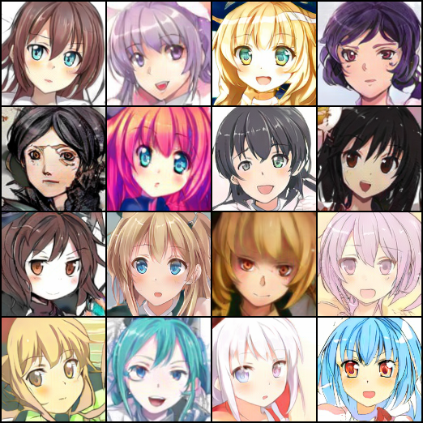
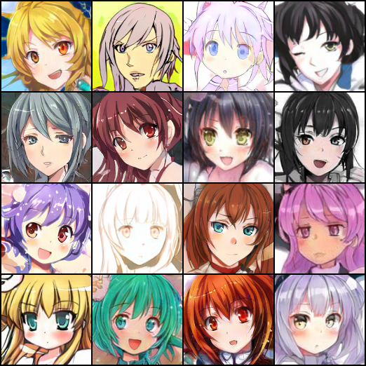

# [WIP] Anime illust generation using various GANs

## models
- dcgan 64, 128

- self-attension GAN

- progressive growing GAN

- cycle GAN
- sn-projection
- style Generator

## Bibliography

[1] [PROGRESSIVE GROWING OF GANS FOR IMPROVED QUALITY, STABILITY, AND VARIATION](https://arxiv.org/abs/1710.10196)
[2] [Self-Attention Generative Adversarial Networks](https://arxiv.org/abs/1805.08318)

